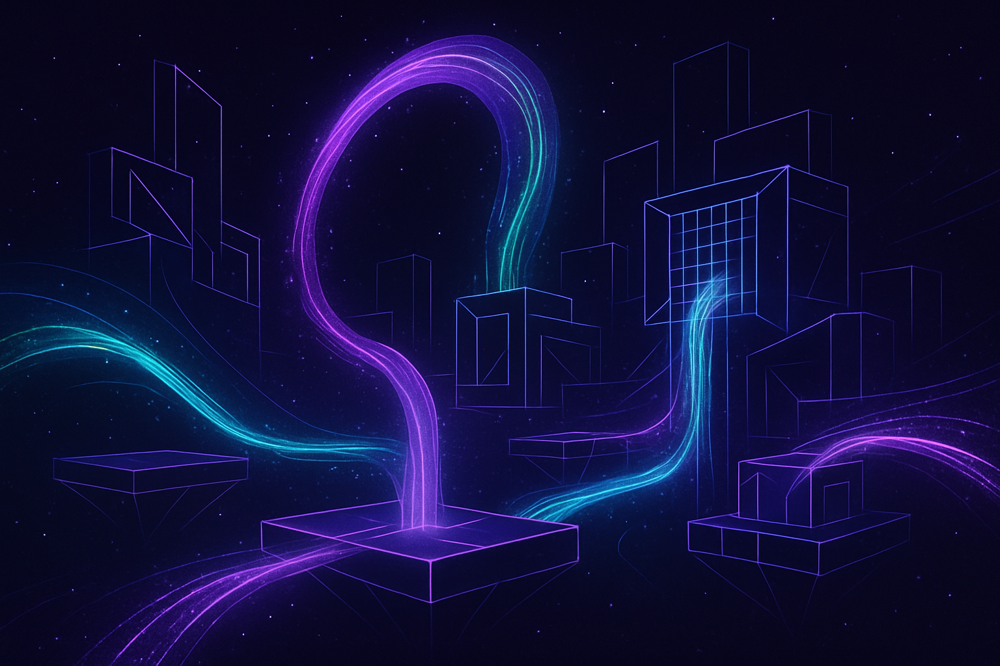

# Chrono-Weave: Temporal Architect

**A revolutionary strategic puzzle game for Monad Game Jam Mission 7**



## 🎮 Game Overview

Chrono-Weave: Temporal Architect is an innovative strategic puzzle game that challenges players to master the art of temporal engineering. Build energy conduits across fractured timelines, optimize quantum networks, and compete for the highest efficiency in this groundbreaking gaming experience.

### 🌟 Key Features

- **Iterative Time Loops**: Each level consists of short time loops where energy flows through your conduits
- **Quantum Entanglement**: Link distant points instantly with quantum nodes
- **Adaptive Obstacles**: Environment responds to your actions, creating temporal anomalies
- **Competitive Leaderboards**: Race against temporal echoes of top players
- **Monad Integration**: Secure, transparent leaderboards powered by Monad Games ID

## 🚀 Live Demo

🔗 **Play Now**: [Chrono-Weave: Temporal Architect](https://chrono-weave-temporal-architect.vercel.app)

## 🛠️ Technology Stack

- **Frontend**: React 18 + Vite
- **Styling**: Tailwind CSS with custom temporal animations
- **UI Components**: Shadcn/UI
- **Icons**: Lucide React
- **Blockchain**: Monad Testnet integration
- **Authentication**: Monad Games ID (Privy Global wallet)

## 🎯 Game Mechanics

### Temporal Architecture
Design and optimize complex energy networks across multiple quantum dimensions. Each placement affects not just the current loop, but creates ripple effects through time that influence future iterations.

### Quantum Mechanics
Harness quantum entanglement to create instant connections across vast distances. Balance energy consumption with strategic advantage as you build increasingly sophisticated temporal networks.

### Time Loop System
- **Energy Sources**: Generate temporal and quantum energy
- **Conduits**: Basic, Quantum, and Temporal conduits with different efficiencies
- **Targets**: Energy destinations that must be reached for scoring
- **Temporal Residue**: Past actions leave traces that affect future loops

### Scoring System
- **Efficiency**: Energy transfer optimization
- **Time Loops**: Number of completed temporal cycles
- **Quantum Entanglement**: Bonus for complex network connections
- **Temporal Echoes**: Learn from previous player strategies

## 🔗 Monad Games ID Integration

### Features
- **Cross-Game Identity**: One username across all Monad games
- **Verifiable Scores**: All achievements recorded on-chain
- **Transparent Leaderboards**: Immutable ranking system
- **Community Challenges**: Share level seeds and compete

### Implementation
- Privy Global wallet integration
- On-chain score submission
- Real-time leaderboard updates
- Secure authentication flow

## 🏆 Mission 7 Compliance

This game fully complies with Monad Game Jam Mission 7 requirements:

✅ **Open Source**: Complete source code available  
✅ **Novel Experience**: Unique temporal mechanics not seen in other games  
✅ **Monad Integration**: Full Monad Games ID implementation  
✅ **Competitive Focus**: Comprehensive leaderboard system  
✅ **No r/place Clone**: Original game concept and mechanics  

## 🎨 Design Philosophy

### Visual Design
- **Dark Sci-Fi Aesthetic**: Deep space backgrounds with neon energy effects
- **Temporal Animations**: Custom CSS animations for energy flow and quantum effects
- **Responsive Layout**: Optimized for all devices and screen sizes
- **Accessibility**: High contrast and clear visual hierarchy

### User Experience
- **Intuitive Controls**: Click-to-place conduit system
- **Progressive Complexity**: Learn through experimentation
- **Immediate Feedback**: Real-time energy flow visualization
- **Competitive Elements**: Global rankings and personal bests

## 🚀 Getting Started

### Prerequisites
- Node.js 18+ 
- pnpm (recommended) or npm

### Installation

```bash
# Clone the repository
git clone https://github.com/mohamedwael201193/Chrono-Weave-Temporal-Architect.git

# Navigate to project directory
cd Chrono-Weave-Temporal-Architect

# Install dependencies
pnpm install

# Start development server
pnpm run dev
```

### Development Commands

```bash
# Start development server
pnpm run dev

# Build for production
pnpm run build

# Preview production build
pnpm run preview

# Lint code
pnpm run lint
```

## 🎮 How to Play

1. **Connect Wallet**: Sign in with Monad Games ID for leaderboard access
2. **Select Conduits**: Choose from Basic, Quantum, or Temporal conduits
3. **Build Networks**: Click on grid cells to place energy conduits
4. **Start Time Loop**: Begin energy simulation and watch the flow
5. **Optimize Efficiency**: Improve your network design for higher scores
6. **Reset Loop**: Start a new temporal cycle with accumulated knowledge
7. **Compete Globally**: Submit scores to the Monad leaderboard

## 🏗️ Project Structure

```
src/
├── components/
│   ├── ui/              # Shadcn/UI components
│   ├── GameBoard.jsx    # Main game logic and grid
│   ├── Leaderboard.jsx  # Global rankings display
│   └── MonadAuth.jsx    # Monad Games ID integration
├── assets/              # Images and static assets
├── App.jsx             # Main application component
├── App.css             # Custom styles and animations
└── main.jsx            # Application entry point
```

## 🌟 Unique Selling Points

### Innovation
- **First-of-its-kind** temporal mechanics in web gaming
- **Quantum entanglement** simulation for strategic depth
- **Time loop learning** system with temporal echoes
- **Blockchain-verified** competitive gaming

### Technical Excellence
- **High-performance** React implementation
- **Custom animations** for immersive experience
- **Responsive design** for all devices
- **Modular architecture** for easy expansion

### Community Focus
- **Open source** development for transparency
- **Monad ecosystem** integration for cross-game identity
- **Competitive leaderboards** for community engagement
- **Educational value** in quantum mechanics concepts

## 🏆 Competition Advantages

### For Mission 7 Victory
1. **Unique Concept**: No other game combines temporal mechanics with blockchain
2. **Technical Quality**: Professional-grade implementation with modern stack
3. **Monad Integration**: Full compliance with Games ID requirements
4. **Visual Polish**: Stunning sci-fi aesthetic with custom animations
5. **Gameplay Depth**: Strategic complexity that rewards mastery
6. **Community Features**: Built for long-term engagement and competition

## 📈 Future Roadmap

### Phase 1: Core Enhancement
- Advanced temporal mechanics
- More conduit types and abilities
- Level editor for community content

### Phase 2: NFT Integration
- Conduit blueprint NFTs
- Tradeable temporal artifacts
- Unique visual customizations

### Phase 3: Multiplayer
- Real-time collaborative building
- Temporal races and competitions
- Guild system for team play

## 🤝 Contributing

We welcome contributions to Chrono-Weave! Please see our contributing guidelines and feel free to submit issues and pull requests.

## 📄 License

This project is open source and available under the MIT License.

## 🙏 Acknowledgments

- **Monad Foundation** for the Game Jam opportunity
- **Privy** for wallet infrastructure
- **Shadcn** for the excellent UI component library
- **Lucide** for beautiful icons
- **Vercel** for deployment platform

## 📞 Contact

- **GitHub**: [mohamedwael201193](https://github.com/mohamedwael201193)
- **Project**: [Chrono-Weave-Temporal-Architect](https://github.com/mohamedwael201193/Chrono-Weave-Temporal-Architect)

---

**Built with ⚡ for Monad Game Jam Mission 7**

*Master time. Build networks. Compete globally.*

